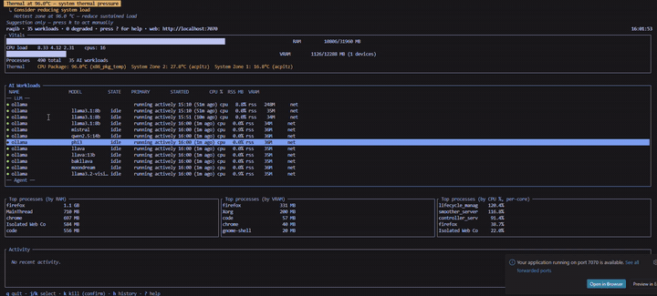
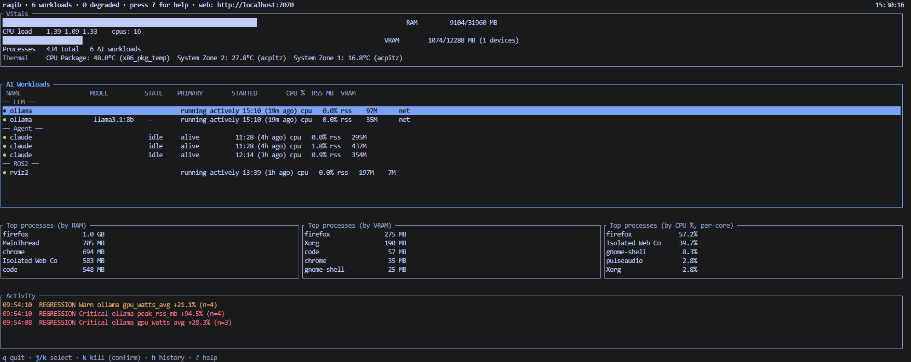
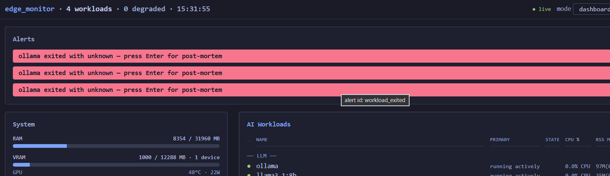
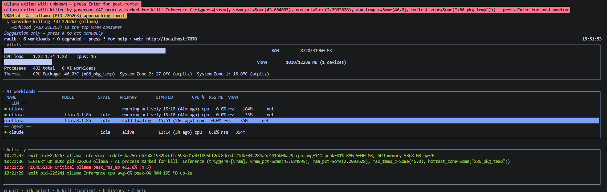

<div align="center">

# raqib

**The watcher for your GPU box.**

One screen for every workload competing for your GPU — ROS 2 nodes, LLM servers, agents — and a governor that can evict the one starving the rest.


<video src="https://github.com/CTX-012/Raqib/raw/main/docs/raqib-demo.mp4" controls muted loop playsinline poster="https://raw.githubusercontent.com/CTX-012/Raqib/main/docs/media/tui-workloads.png" width="720">
Your browser can't play the embedded video. <a href="docs/raqib-demo.mp4">Download the 64-second narrated demo (3.2 MB, MP4)</a>.
</video>



**Also:** [silent + captions MP4](docs/raqib-demo-silent.mp4) · [SRT captions](docs/raqib-demo.srt) · [6s hero GIF above](docs/demo.gif)

**[Full documentation](https://ctx-012.github.io/Raqib/)** · [Screenshots](#screenshots) · [Media guardrails](docs/MEDIA.md) · [Video plan](docs/VIDEO_PLAN.md)

</div>

---

## Why raqib?

You run more than one thing on one GPU — a ROS 2 stack, an LLM server, a couple of agents. They fight over the same VRAM. One balloons, and everything else grinds, or the box OOMs and takes your work down with it.

Tools like `nvtop`, `btop`, and `ollama ps` show you *that* it happened — all read-only, five terminals deep. **raqib is one screen for all of it, and it can act.**

- **One pane of glass** for every GPU/VRAM/CPU/thermal workload — ROS 2, ollama, vLLM, llama.cpp, agents.
- **Honest metrics** — unmeasurable VRAM shows an em dash, never a fake 0.
- **Live LLM health** — reachability + tokens/sec for ollama, vLLM, llama.cpp.
- **The governor** — can terminate a workload starving the others. **Off by default, opt-in.**
- **Built for a shared robotics + AI box.**

---

## Quick start

```bash
# prerequisites: build-essential, pkg-config, libssl-dev, git,
#                Rust 1.88+ (install via rustup — distro packages are usually too old)
git clone https://github.com/CTX-012/Raqib.git raqib
cd raqib

# build the raqib binary (web dashboard assets are pre-built + committed)
cargo build --release
sudo install -m755 target/release/raqib /usr/local/bin/raqib

# first run
raqib init      # writes a safe-by-default config to ~/.config/raqib/raqib.toml
raqib           # TUI + web dashboard on http://localhost:7070
```

The web dashboard's built bundle (`web/dist/`) is committed to the repo, so
`cargo build --release` works standalone — no Node.js required for end users.
Contributors who modify anything under `web/src/` need Node.js 20+ and must
regenerate the bundle with `npm --prefix web ci && npm --prefix web run build`
before committing; CI enforces that the committed `web/dist/` matches a fresh
build.

Monitoring is on; the governor is off. Open `http://localhost:7070` for the web view.

**Common commands:**

```bash
raqib --no-ui        # web only (use for background/service runs)
raqib --no-web       # TUI only
raqib config check   # validate config + print the loaded policy
raqib --help
```

---

## Safety in one line

raqib can kill processes, but **out of the box it kills nothing** — it observes. The governor only acts after you deliberately flip both `auto_actuate = true` *and* `default_ai_action = "Kill"` in the config file (the web API can't arm it — seven tripwire tests pin the boundary). The auto-kill path itself is **proven live** (RAM canary + 19-cell signal × threshold matrix all green). Before arming, run `raqib config check` to see exactly what will and won't be killed. See the [governor guide](https://ctx-012.github.io/Raqib/#governor) for the four gates and the pre-arm checklist.

The web dashboard is also **secure-by-default** — `--bind 127.0.0.1` (localhost-only) unless you explicitly opt into `--bind 0.0.0.0` (LAN); doing that without an `auth_token` fires a loud startup WARN.

---

## Documentation

Full guides, config reference, examples, and troubleshooting live on the **[documentation site](https://ctx-012.github.io/Raqib/)** — one page, anchor-linked:

- **[Installation](https://ctx-012.github.io/Raqib/#install)** and **[first run](https://ctx-012.github.io/Raqib/#first-run)**
- **[The TUI](https://ctx-012.github.io/Raqib/#tui)** + **[keybindings](https://ctx-012.github.io/Raqib/#tui-keys)**
- **[The web dashboard](https://ctx-012.github.io/Raqib/#web-modes)** (5 modes) + the **[Settings panel](https://ctx-012.github.io/Raqib/#web-settings)**
- **[Configuration](https://ctx-012.github.io/Raqib/#config)** — every key with the real defaults
- **[The governor](https://ctx-012.github.io/Raqib/#governor)** — the four gates, the two kill paths, the pre-arm checklist
- Hands-on: **[see an LLM appear](https://ctx-012.github.io/Raqib/#exp-llm)** · **[safe kill demo (canary)](https://ctx-012.github.io/Raqib/#exp-kill)** · **[reclaim VRAM from ollama](https://ctx-012.github.io/Raqib/#exp-ollama-kill)**
- **[REST API](https://ctx-012.github.io/Raqib/#api)** · **[Integrations](https://ctx-012.github.io/Raqib/#integrations)** · **[Troubleshooting](https://ctx-012.github.io/Raqib/#troubleshooting)** · **[FAQ](https://ctx-012.github.io/Raqib/#faq)**

---

## Screenshots

<a name="screenshots"></a>

Live captures from the dev box on the current `main` branch. Every image is
governed by [`docs/MEDIA.md`](docs/MEDIA.md), which tracks exactly what each
one can and cannot be captioned with.

| | |
|---|---|
|  | The **TUI** — vitals, workloads sorted by category (LLM / Agent / Vision / ROS 2), top processes, activity feed. One screen for everything competing for the GPU. |
|  | The **web dashboard** at `localhost:7070` — the same live data in the browser. Read state, tune thresholds, persist to your TOML. |
|  | The **activity feed** — kill audit trail, workload starts/stops, and threshold events land here. |

The demo GIF at the top of this README is a 6-second loop of the same TUI
running against the real workload mix — no kill happens in it. The 64-second
[narrated demo](docs/raqib-demo.mp4) walks the whole arc; scene 5 (the auto-kill
moment) currently uses an animated still + audit-log reconstruction, per the
fallback in [`docs/VIDEO_PLAN.md` §9](docs/VIDEO_PLAN.md) — the real footage
lands once the reshoot does.

---

## About the name

**raqib** (Arabic) — *"the watchful one, who observes and guards."* A tool that watches over your workloads so you don't have to.

---

## Contributing

Issues and PRs welcome — especially first-run friction reports.

```bash
cargo test --workspace
cargo clippy --workspace --all-targets -- -D warnings
npm --prefix web run test:browser
```

## License

Dual-licensed under either of:

- [MIT license](LICENSE-MIT)
- [Apache License 2.0](LICENSE-APACHE)

at your option. Contributions are accepted under the same terms.
